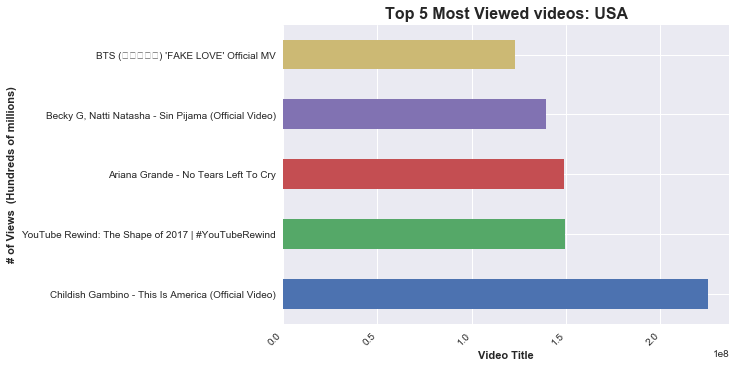
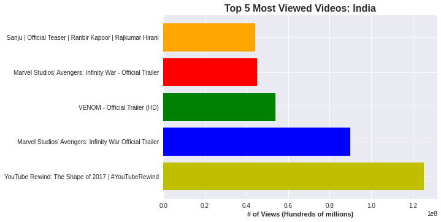
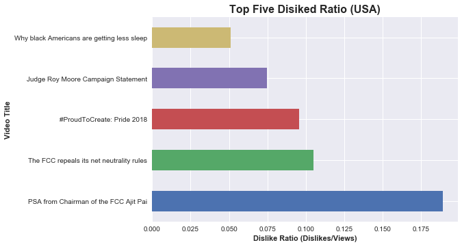
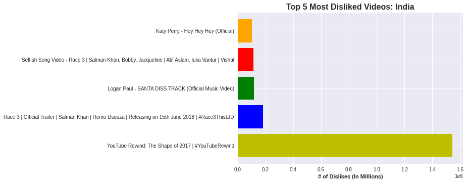
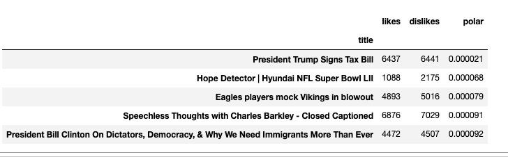

# Case Study 1: YouTube Trending Videos

Case Study on Youtube Video data

We decided to utilitze the YouTube video statistics dataset located [here](https://www.kaggle.com/datasnaek/youtube-new). Here's a brief description of the dataset:

> Trending YouTube Video Statistics
> YouTube (the video sharing website) maintains a list of the top-trending videos on its platform. This dataset includes several months of data on up to 200 daily trending YouTube videos from the US, Great Britain, Germany, Canada, France, and other countries. Each region’s data is in a separate file. Data includes the video title, channel title, publish time, tags, views, likes and dislikes, description, and comment count. These statistics were taken between the years 2017 and 2018.
>

After reviewing the data we decided to answer a series of questions segemented by the following three countries:
- USA 
- Great Britain
- India

The questions we decided to explore are:

1. Top Five viewed videos
2. Top Five most disliked videos
    - As a percentage of view
3. Top Five liked videos
    - As a percentage of views
4. Top Five most commented vidoes
5. Top Five most polarized videos (defined by ratio of likes to dislikes)

## Top Five Most Viewed Videos 
USA

GREAT BRITAIN
.png)

INDIA

Commentary 

## Top Five Most Disliked Videos

USA

INDIA

GREAT BRITAIN
.png)
.png)

## Top Five Liked Videos
USA
.png)

GREAT BRITAIN
.png)
.png)

INDIA
.png)

## Top Five Most Polarized Videos
USA

GREAT BRITAIN
.png)

## Conclusion: 
USA and Great Britain had pretty similar YouTube data results which we figured would be the case. USA and Great Britain both had their most viewed and most liked videos for the music genre. It was apparent that India had different types of videos that were most viewed revolving more around movies and technology. 

We found the results for the Most Polarized Videos was very interesting and there were some videos involving politics and sports which makes sense. [abs(dislike_ratio - like_ratio)]